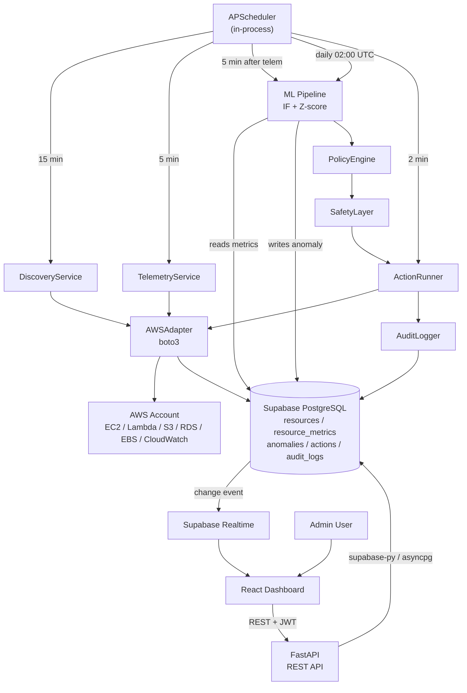

# CloudSentry — Engineering Outline
**Source:** PRD v1.0 + Tech Stack v1.0 | **Date:** 2026-09-19 | **Status:** Implementation-Ready

---

## 1. Project Overview

CloudSentry is an AWS cost intelligence system that discovers real cloud resources via boto3, collects live telemetry from CloudWatch, detects cost anomalies using Isolation Forest (with Z-score cold-start fallback), and autonomously executes safe optimizations (EC2 stop, Lambda concurrency limit, resource tagging) through AWS APIs — with every decision governed by a policy engine, guarded by a safety layer, and surfaced through a React dashboard backed by Supabase.

- **Primary objective:** Close the detect → decide → act loop for AWS cost anomalies with full audit trails and hard safety controls.
- **Core users:** Student/developer team operating a live AWS free-tier account; demo operators.
- **Key constraints:** 1–4 developers; AWS free tier; Supabase free tier; Render free/starter; no destructive auto-actions; dry-run mode on by default; ≤ $10/month cloud spend.

---

## 2. Scope

### In Scope
- AWS resource discovery: EC2, Lambda, S3, RDS, EBS
- CloudWatch telemetry: CPU, network, invocations, duration, errors, storage, DB connections (5-min polling)
- Time-series metric storage in Supabase PostgreSQL (90-day retention)
- Estimated cost calculation from static AWS pricing JSON (not actual billing)
- Anomaly detection: Isolation Forest (primary, day 7+), EWMA (day 3–7), Z-score (day 0–2)
- Anomaly types: idle compute, runaway Lambda, untagged resource (MVP); unused volume, traffic spike (V2)
- Policy engine: JSONB condition trees evaluated against anomaly + resource + system state
- Safety layer: kill-switch, dry-run mode, daily action limits, per-resource cooldowns, protected resource list
- Automated actions: EC2 stop (MEDIUM), Lambda concurrency limit (MEDIUM), apply tags (LOW)
- Approval-gated actions: RDS stop, EBS volume deletion (HIGH — never auto-execute)
- Rollback: EC2 start, Lambda concurrency restore
- React dashboard: overview, anomaly center, optimization center, resource explorer, cost analytics, audit log
- Supabase Auth (email/password, single admin user)
- Supabase Realtime: anomaly INSERT + action UPDATE events to dashboard
- Full audit log for every automated API call
- Emergency stop endpoint (`POST /system/emergency-stop`)

### Out of Scope
- GCP/Azure support (V2 via CloudAdapter ABC)
- Actual billing data from Cost Explorer (24–48h lag; V2)
- Prophet model (insufficient data for MVP demo window)
- SHAP explainability (V2)
- Multi-user auth / multi-account AWS (V2)
- Traffic spike + unused volume detection (V2)
- Email/Slack alerting
- Kubernetes, Kafka, Redis, Celery, TimescaleDB, Terraform
- Any automatic resource deletion (blocked at architecture level, not just policy)

---

## 3. System Architecture

### Major Components

| Layer | Technology | Role |
|---|---|---|
| Frontend | React 18 + Vite + TypeScript | Dashboard UI; consumes FastAPI REST + Supabase Realtime |
| Backend API | FastAPI + Python 3.11 | REST API, policy evaluation, safety enforcement, action execution |
| Scheduler | APScheduler (in-process) | Periodic telemetry, discovery, ML inference, training, cleanup |
| ML Pipeline | scikit-learn + scipy + pandas | IF training/inference; Z-score fallback; anomaly record creation |
| Cloud Adapter | boto3 (AWSAdapter) | All AWS API calls: discovery, CloudWatch, stop/start/tag |
| Database | Supabase PostgreSQL | Relational data + time-series metrics (standard indexes, no TimescaleDB) |
| Auth | Supabase Auth | Email/password login; JWT issued to frontend, verified by FastAPI |
| Realtime | Supabase Realtime | Push anomaly/action changes to dashboard (postgres_changes) |
| AWS | EC2, Lambda, S3, RDS, EBS, CloudWatch | Monitored + acted upon resources |

### Data Flow Diagram



---

## 4. Component Breakdown

| Component | Responsibility | Inputs | Outputs | Dependencies |
|---|---|---|---|---|
| **AWSAdapter** | All boto3 calls; retry logic; error normalization | Config (region, creds) | Typed resource dicts, metric data, action results | boto3, botocore |
| **DiscoveryService** | Enumerate EC2/Lambda/S3/RDS/EBS; diff vs DB state; write resources table | AWSAdapter | `resources` rows; `audit_logs` (state changes) | AWSAdapter, supabase-py |
| **TelemetryService** | Batch CloudWatch `get_metric_data`; write resource_metrics | AWSAdapter, resources table | `resource_metrics` rows | AWSAdapter, asyncpg |
| **CostEstimationService** | Multiply usage metrics × static pricing JSON → estimated cost per resource | `resource_metrics`, `aws_us_east_1.json` | `cost_records` rows | asyncpg, pricing JSON |
| **ML Pipeline** | Feature engineering; cold-start gate; IF inference; Z-score fallback; write anomalies | `resource_metrics` (asyncpg) | `anomalies` rows | scikit-learn, scipy, pandas, joblib, asyncpg, supabase-py |
| **MLTrainer** | Daily IF model training; version management; serialize to disk | `resource_metrics` (30d) | `.pkl` model files in `/models/` | scikit-learn, joblib, asyncpg |
| **PolicyEngine** | Evaluate JSONB condition tree against anomaly + resource + system state; select action | `anomalies`, `resources`, `system_config`, `policies` | Action decision (type, risk, requires_approval) | supabase-py |
| **SafetyLayer** | Enforce kill-switch, dry-run, budget cap, daily action count, cooldown, protected list | `system_config`, `optimization_actions` | Pass/block decision | supabase-py |
| **ActionRunner** | Execute AWS API call; poll for verification; write pre/post state; handle rollback | Policy decision, AWSAdapter | `optimization_actions` row (completed/failed); rollback action | AWSAdapter, supabase-py |
| **AuditLogger** | Write audit record before+after every API call | Actor, resource_id, action_id, API call, params, result | `audit_logs` row | supabase-py |
| **APScheduler** | Trigger all periodic jobs; handle misfire; log job outcomes | FastAPI lifespan startup | Job execution calls | APScheduler, all services |
| **FastAPI API** | REST endpoints; JWT verification; delegate to services | HTTP requests + JWT | JSON responses | supabase-py, asyncpg, PolicyEngine, SafetyLayer, ActionRunner |
| **React Dashboard** | Render all 6 views; subscribe to Realtime; call FastAPI for writes | FastAPI REST, Supabase PostgREST (reads), Supabase Realtime | Dashboard UI | @supabase/supabase-js, Axios, TanStack Query, Recharts |

---

## 5. Data Architecture

### Entities and Key Fields

| Entity | Key Fields | Notes |
|---|---|---|
| `cloud_accounts` | id, provider (`aws`), account_id, alias, region, created_at | Single row MVP |
| `resources` | id, account_id→, provider_id (e.g. `i-0abc`), resource_type, name, region, state, tags (JSONB), protected, first_seen, last_seen, metadata (JSONB) | Updated each discovery cycle |
| `resource_metrics` | id (BIGSERIAL), time (TIMESTAMPTZ), resource_id→, metric_name, value, unit | Append-only; index on (resource_id, time DESC); partial index last 7 days |
| `cost_records` | id, resource_id→, estimated_cost_usd, actual_cost_usd (NULL in MVP), billing_period_start/end, source (`estimated`/`cost_explorer`), recorded_at | actual_cost_usd populated V2 only |
| `anomalies` | id, resource_id→, anomaly_type, severity (LOW/MEDIUM/HIGH), anomaly_score, confidence, detected_at, resolved_at, reason (TEXT), features_snapshot (JSONB), model_version, status (`active`/`resolved`/`false_positive`) | Trigger for Supabase Realtime on INSERT |
| `optimization_actions` | id, anomaly_id→, resource_id→, action_type, risk_level, status, dry_run, requires_approval, approved_by, approved_at, created_at, executed_at, verified_at, pre_state (JSONB), post_state (JSONB), estimated_savings_usd, rollback_action_id→ | Trigger for Supabase Realtime on UPDATE |
| `audit_logs` | id, event_type, actor (`SYSTEM`/`USER:<id>`), resource_id→, action_id→, aws_api_call, request_params (JSONB), response_status, message, created_at | Append-only; never updated |
| `policies` | id, name, enabled, resource_type, anomaly_type, conditions (JSONB), action_type, risk_level, requires_approval, cooldown_minutes, priority | 3 seeded defaults |
| `system_config` | key (PK), value, updated_at | Kill-switch, dry-run, budget limits |

### Relationships
```
cloud_accounts ──< resources ──< resource_metrics
                             ──< cost_records
                             ──< anomalies ──< optimization_actions ──> (rollback) optimization_actions
                             ──< audit_logs
                                              ──< audit_logs
```

### Data Flow
1. **Discovery** → writes/updates `resources`; diffs state → `audit_logs`
2. **Telemetry** → appends to `resource_metrics`
3. **Cost estimation** → appends to `cost_records`
4. **ML inference** → reads `resource_metrics` (asyncpg) → writes `anomalies` (supabase-py)
5. **Policy + Action** → reads `anomalies`, `resources`, `system_config`, `policies` → writes `optimization_actions`, `audit_logs`
6. **Realtime** → Supabase broadcasts `anomalies` INSERT, `optimization_actions` UPDATE to frontend WebSocket

### Storage Responsibilities
- **Supabase PostgreSQL:** all entities above
- **Backend filesystem (`/models/`):** serialized `.pkl` model files (5 versions retained)
- **Backend filesystem (`/data/pricing/`):** `aws_us_east_1.json` static pricing table
- **No Supabase Storage used**

---

## 6. API / Interface Outline

All FastAPI endpoints require `Authorization: Bearer <supabase_jwt>` except `/health`.  
Base: `/api/v1`

| Method | Route | Purpose | Input | Output | Auth |
|---|---|---|---|---|---|
| GET | `/health` | System health check | — | `{db, ml_model, aws_connectivity, telemetry, automation}` | None |
| GET | `/resources` | List discovered resources | query: `type`, `state`, `region` | `[{id, provider_id, type, state, region, tags, estimated_cost, protected}]` | JWT |
| GET | `/resources/{id}` | Resource detail + 24h metrics + anomalies | — | `{resource, metrics_24h, anomalies, actions}` | JWT |
| POST | `/resources/discover` | Trigger immediate discovery | — | `{job_id, status}` | JWT |
| GET | `/metrics/{resource_id}` | Time-series data | query: `metric`, `from`, `to` | `[{time, value}]` | JWT |
| GET | `/metrics/{resource_id}/summary` | Latest metric snapshot | — | `{cpu, network_in, network_out, ...}` | JWT |
| GET | `/anomalies` | List anomalies | query: `status`, `severity`, `resource_id` | `[{id, resource, type, score, confidence, reason, severity, detected_at}]` | JWT |
| GET | `/anomalies/{id}` | Anomaly detail + feature snapshot | — | Full anomaly record + features_snapshot | JWT |
| PATCH | `/anomalies/{id}/status` | Mark false_positive or resolved | `{status}` | `{id, status}` | JWT |
| GET | `/actions` | List optimization actions | query: `status`, `risk_level` | `[{id, resource, action_type, status, risk, dry_run, requires_approval}]` | JWT |
| GET | `/actions/{id}` | Action detail with pre/post state | — | Full action record | JWT |
| POST | `/actions/{id}/approve` | Approve HIGH-risk pending action | — | `{status: approved}` | JWT |
| POST | `/actions/{id}/execute` | Execute approved action (or re-trigger) | — | `{status, job_id}` | JWT |
| POST | `/actions/{id}/rollback` | Rollback completed reversible action | — | `{rollback_action_id, status}` | JWT |
| GET | `/dashboard/overview` | Summary cards data | — | `{total_cost_est, resource_count, anomaly_count, savings_achieved, automation_status, dry_run}` | JWT |
| GET | `/dashboard/cost-trend` | Cost over time | query: `days` (default 7) | `[{date, cost_usd}]` | JWT |
| GET | `/dashboard/anomaly-summary` | Severity breakdown counts | — | `{HIGH, MEDIUM, LOW, total}` | JWT |
| GET | `/system/config` | View system config + limits | — | `{dry_run, automation_enabled, max_actions, budget, ...}` | JWT |
| PATCH | `/system/config` | Update config key | `{key, value}` | `{key, value, updated_at}` | JWT |
| POST | `/system/emergency-stop` | Disable all automation immediately | — | `{automation_enabled: false}` | JWT |
| GET | `/audit-logs` | Audit log entries | query: `from`, `to`, `resource_id`, `limit` | `[{event_type, actor, resource_id, aws_api_call, result, created_at}]` | JWT |

**Supabase PostgREST (frontend direct reads, JWT + RLS):**  
Frontend may read `resources`, `anomalies`, `optimization_actions`, `audit_logs`, `policies`, `system_config` directly via PostgREST with the anon key + user JWT. All writes and cloud operations must go through FastAPI.

---

## 7. Core Workflows

### WF-1: Resource Discovery (every 15 min)
1. APScheduler triggers `DiscoveryService.run()`
2. `AWSAdapter` calls: `describe_instances`, `list_functions`, `list_buckets`, `describe_db_instances`, `describe_volumes`
3. For each resource: upsert into `resources` (match on `provider_id`)
4. If state changed vs DB: write state-change event to `audit_logs`
5. Resources not seen in last 2 cycles: mark `last_seen` stale (do not delete)
6. **Error path:** `ClientError` / network timeout → log structured error; skip resource; retry next cycle

### WF-2: Telemetry Collection (every 5 min)
1. APScheduler triggers `TelemetryService.run()`
2. Load all active resources from Supabase `resources`
3. Build `MetricDataQuery` list (up to 500 queries per `get_metric_data` call [VERIFY limit])
4. Call `cloudwatch.get_metric_data()` — batched per resource type
5. Normalize response → insert into `resource_metrics` via asyncpg bulk insert
6. Update `CostEstimationService` → write/update `cost_records`
7. **Error path:** Empty CloudWatch response (resource too new, stopped) → skip silently; no zero-value insert

### WF-3: ML Inference (every 5 min, after telemetry)
1. APScheduler triggers `MLPipeline.run_inference()`
2. For each active resource:
   a. Query last 30 days of `resource_metrics` via asyncpg
   b. **Cold-start gate:** `< 144 data points` → Z-score; `< 2016` → EWMA; else → IF
   c. Engineer feature vector (rolling avgs, ratios, time_of_day, etc.)
   d. Score via loaded `.pkl` model (or scipy Z-score)
   e. If `score < ML_ANOMALY_THRESHOLD` (default `-0.3`): create anomaly record
3. Write anomaly to `anomalies` via supabase-py
4. Supabase Realtime broadcasts INSERT → frontend
5. **Error path:** Model file missing → fall back to Z-score; log `model_version=zscore_fallback`

### WF-4: Policy Evaluation → Action Creation
1. After anomaly written: `PolicyEngine.evaluate(anomaly_id)` called inline
2. Load enabled policies (ordered by priority ASC) from `policies`
3. Evaluate JSONB condition tree against: anomaly fields, resource fields, `system_config`
4. First matching policy wins
5. If match: `SafetyLayer.check(action_type, resource_id)`:
   - Kill-switch check (`GLOBAL_AUTOMATION_ENABLED`)
   - Dry-run check (`DRY_RUN_MODE`)
   - Daily action count < `MAX_ACTIONS_PER_DAY`
   - Per-resource cooldown elapsed
   - Resource not in protected list / not tagged `cloudsentry:protected=true`
6. Pass: create `optimization_actions` row (status=`pending` or `pending_approval`)
7. Block: log reason to `audit_logs`; no action created
8. **Dry-run path:** Action created with `dry_run=true`; log "WOULD [action]"; no AWS API call

### WF-5: Action Execution (AUTO or APPROVED)
1. LOW/MEDIUM risk + `requires_approval=false` + `dry_run=false`: ActionRunner auto-executes
2. HIGH risk: status = `pending_approval`; dashboard shows APPROVE button; user clicks → `POST /actions/{id}/approve`; then `POST /actions/{id}/execute`
3. **Pre-execution:** Write pre_state JSONB (current AWS resource state) to `optimization_actions`
4. Write audit record (actor=`SYSTEM`, api_call, params)
5. Call `AWSAdapter` (e.g. `ec2.stop_instances()`); handle `ClientError`
6. **Verification:** APScheduler 2-min job polls `describe_instances` until target state reached (timeout: 5 min)
7. Write post_state JSONB; update action status to `completed`
8. Supabase Realtime broadcasts UPDATE → dashboard
9. **Failure path:** `ClientError` or timeout → mark status=`failed`; if pre_state stored → trigger rollback; write to audit_logs

### WF-6: Rollback
1. User clicks Rollback in Optimization Center → `POST /actions/{id}/rollback`
2. FastAPI validates: action is `completed` + action_type is reversible + no existing rollback
3. Retrieve pre_state from original action
4. Create new `optimization_actions` row (type=rollback, links to original via `rollback_action_id`)
5. Execute inverse AWS API call (e.g. `ec2.start_instances()`)
6. Verify + write post_state; mark rollback action `completed`

### WF-7: Emergency Stop
1. `POST /system/emergency-stop` (JWT required)
2. Write `GLOBAL_AUTOMATION_ENABLED=false` to `system_config`
3. All subsequent `SafetyLayer.check()` calls fail immediately
4. In-flight actions (polling verification jobs): completed if AWS call already made; new calls blocked
5. Dashboard: red banner via Supabase Realtime on `system_config` update (or 5-sec poll)

### WF-8: Dashboard Real-Time Update
1. Frontend subscribes on mount: `supabase.channel().on('postgres_changes', {event:'INSERT', table:'anomalies'}, ...)`
2. New anomaly → invalidate TanStack Query cache for `/anomalies` → refetch → render
3. Action status update → invalidate `/actions` cache
4. Fallback: TanStack Query `refetchInterval: 30000` (30s) for all tables → ensures eventual consistency even if Realtime drops

---

## 8. AI/ML Architecture

### Models

| Model | When Active | Input | Output |
|---|---|---|---|
| **IsolationForest** | Day 7+ (≥ 2016 data points per resource) | Feature vector (9 dimensions, see below) | `score ∈ [-1, 0]`; `is_anomaly = score < -0.3` |
| **EWMA threshold** | Day 3–7 (288–2016 points) | Single metric rolling EWMA | Deviation from EWMA baseline |
| **Z-score (scipy)** | Day 0–3 (<288 points), model file missing | `(current - rolling_mean) / rolling_std` | `|z| > 2.5` → anomaly |

### Feature Vector (IF)
```
[rolling_avg_cpu_1h, rolling_avg_cpu_24h, cpu_deviation_ratio,
 network_in_ratio, invocation_spike_ratio, error_rate,
 hours_unattached, time_of_day, estimated_cost_per_hour]
```
Missing features for resource type (e.g. `invocation_spike_ratio` on EC2) → fill with `0.0`.

### Training
- **Trigger:** APScheduler cron daily at 02:00 UTC
- **Data:** asyncpg query: last 30 days of `resource_metrics` per resource type
- **Model per resource type** (ec2, lambda, s3, rds, ebs) — separate `.pkl` files
- **Output path:** `/models/if_{resource_type}_{YYYY-MM-DD}.pkl`; retain 5 versions; delete older
- **Minimum data gate:** Skip training if < 2016 rows for resource type (use Z-score instead)

### Inference
- **Trigger:** APScheduler every 5 min, after telemetry collection
- **Load:** `joblib.load(latest_model_path)` per resource type
- **Anomaly record creation:** deterministic Python logic reads score threshold from `ML_ANOMALY_THRESHOLD` env var
- **Model version:** written to `anomalies.model_version` for traceability

### Evaluation
- **Method:** Synthetic anomaly injection via `scripts/inject_anomaly.py` → known labels → compute precision/recall
- **Targets:** Precision ≥ 0.75, Recall ≥ 0.70, F1 ≥ 0.72 (TBD after evaluation run)
- **Not evaluated on real labeled cloud data** (no labeled dataset exists)

### Fallback Chain
```
IF model available AND ≥ 2016 points → IsolationForest
ELIF ≥ 288 points → EWMA threshold
ELSE → Z-score (scipy)
```
Fallback is deterministic, not ML — no model file required.

**Separation:** All `anomaly_type` classification (idle_compute, runaway_lambda, untagged) is **deterministic rule logic** applied after the ML score. ML provides the anomaly score; rules map it to a type.

---

## 9. Repository Structure

```
cloudsentry/
├── backend/
│   ├── app/
│   │   ├── main.py                  # FastAPI app + lifespan (scheduler start/stop)
│   │   ├── config.py                # Pydantic Settings — all env vars
│   │   ├── api/
│   │   │   ├── resources.py
│   │   │   ├── metrics.py
│   │   │   ├── anomalies.py
│   │   │   ├── actions.py
│   │   │   ├── dashboard.py
│   │   │   ├── system.py
│   │   │   └── audit.py
│   │   ├── services/
│   │   │   ├── discovery.py         # DiscoveryService
│   │   │   ├── telemetry.py         # TelemetryService
│   │   │   ├── cost_estimator.py    # CostEstimationService
│   │   │   ├── anomaly_detector.py  # MLPipeline orchestrator (calls ml/ modules)
│   │   │   ├── policy_engine.py     # PolicyEngine
│   │   │   ├── safety_layer.py      # SafetyLayer
│   │   │   ├── action_runner.py     # ActionRunner + verification
│   │   │   └── audit_logger.py      # AuditLogger
│   │   ├── adapters/
│   │   │   ├── base.py              # CloudAdapter ABC
│   │   │   └── aws.py               # AWSAdapter (boto3 wrapper)
│   │   ├── db/
│   │   │   ├── supabase_client.py   # supabase-py client singleton
│   │   │   └── asyncpg_pool.py      # asyncpg connection pool
│   │   ├── scheduler.py             # APScheduler job registration
│   │   ├── auth.py                  # JWT verification dependency
│   │   └── schemas/                 # Pydantic request/response models
│   ├── tests/
│   │   ├── unit/                    # Pure function tests (no I/O)
│   │   ├── integration/             # FastAPI TestClient + moto + Supabase local
│   │   ├── ml/                      # Synthetic anomaly tests
│   │   ├── safety/                  # Kill-switch, dry-run, limit enforcement
│   │   └── cloud/                   # @pytest.mark.cloud — real AWS, skipped in CI
│   └── requirements.txt
├── ml/
│   ├── trainer.py                   # IF model training pipeline (called by anomaly_detector.py)
│   ├── inference.py                 # IF inference + score normalization
│   ├── baseline.py                  # Z-score + EWMA fallback
│   ├── features.py                  # Feature engineering (pandas transforms)
│   ├── evaluation.py                # Precision/recall on synthetic dataset
│   └── synthetic/
│       ├── generator.py             # Synthetic metric series generator
│       └── scenarios/               # idle_ec2.json, runaway_lambda.json, untagged.json
├── frontend/
│   ├── src/
│   │   ├── main.tsx
│   │   ├── App.tsx
│   │   ├── lib/
│   │   │   ├── supabase.ts          # Supabase client (anon key)
│   │   │   └── api.ts               # Axios instance (FastAPI base URL + JWT inject)
│   │   ├── hooks/
│   │   │   ├── useAnomalies.ts      # TanStack Query + Realtime subscription
│   │   │   ├── useActions.ts
│   │   │   ├── useResources.ts
│   │   │   └── useSystemConfig.ts
│   │   ├── components/
│   │   │   ├── Overview.tsx
│   │   │   ├── AnomalyCenter.tsx
│   │   │   ├── OptimizationCenter.tsx
│   │   │   ├── ResourceExplorer.tsx
│   │   │   ├── CostAnalytics.tsx
│   │   │   ├── AuditLog.tsx
│   │   │   └── ui/                  # shadcn/ui components
│   │   ├── pages/
│   │   │   ├── Login.tsx
│   │   │   └── Dashboard.tsx
│   │   └── types/                   # TypeScript types matching Supabase schema
│   ├── index.html
│   ├── vite.config.ts
│   ├── tailwind.config.ts
│   └── package.json
├── db/
│   └── migrations/                  # Supabase CLI migration SQL files
│       ├── 001_initial_schema.sql
│       ├── 002_indexes.sql
│       ├── 003_rls_policies.sql
│       └── 004_seed_policies.sql    # 3 default policies + system_config defaults
├── models/                          # Serialized ML model files (.pkl) — gitignored
├── scripts/
│   ├── provision_demo.sh            # Provision AWS demo resources
│   ├── shutdown_demo.sh             # Stop/clean AWS demo resources
│   ├── inject_anomaly.py            # Insert synthetic metric data into Supabase
│   └── run_stress.sh                # SSH to EC2 and run `stress` command
├── data/
│   └── pricing/
│       └── aws_us_east_1.json       # Static AWS pricing table
├── .github/
│   └── workflows/
│       └── ci.yml
├── docker-compose.yml               # Backend service (local dev only)
├── .env.example
├── .gitignore                       # Must include: .env, models/, *.pkl
└── README.md
```

---

## 10. Implementation Phases

### Phase 0 — Foundation (Week 1)
**Objective:** Working local environment; AWS connectivity verified; Supabase project live.

| Task | Done When |
|---|---|
| Create Supabase project (dev); run migrations 001–004 | All tables + RLS + seed policies visible in Supabase Studio |
| Provision AWS demo resources via `provision_demo.sh` | EC2, Lambda, S3, RDS, EBS visible in AWS console |
| Create IAM user `cloudsentry-agent`; attach least-privilege policy | `aws sts get-caller-identity` succeeds; CloudWatch metrics appear |
| Set up Python 3.11 venv; install requirements; validate boto3 connects | `aws.py` adapter unit test passes with moto |
| Set up Vite + React + Supabase client; login page renders | Supabase Auth login works; JWT returned |
| Configure `.env` from `.env.example` | All env vars documented; no secrets committed |

**Dependencies:** None  
**Definition of Done:** Developer can run backend locally, connect to Supabase, and list AWS resources via a Python REPL.

---

### Phase 1 — Resource Discovery + Telemetry (Weeks 2–3)
**Objective:** Live data flowing from AWS into Supabase.

| Task | Done When |
|---|---|
| Implement `AWSAdapter` (all 5 resource types) | Unit tests pass against moto; all describe calls return typed dicts |
| Implement `DiscoveryService` + APScheduler job (15 min) | 5 demo resources appear in Supabase `resources` after one run |
| Implement `TelemetryService` (batched `get_metric_data`) + asyncpg bulk insert | 10 metric types written to `resource_metrics`; 24h data visible |
| Implement `CostEstimationService` (static pricing JSON) | `cost_records` rows created; estimated cost matches AWS calculator within ±20% |
| FastAPI `/resources`, `/metrics/*`, `/health` endpoints | Endpoints return correct data; tested with httpx |
| Supabase migration for all schemas + indexes | `resource_metrics` index on (resource_id, time DESC) confirmed with `EXPLAIN` |

**Dependencies:** Phase 0  
**Definition of Done:** Query Supabase: ≥ 24h of metric rows; all 5 resources present; `/health` returns green.

---

### Phase 2 — ML Pipeline + Anomaly Detection (Weeks 4–5)
**Objective:** Anomalies detected and written to Supabase; cold-start fallback verified.

| Task | Done When |
|---|---|
| Implement `features.py` — feature engineering on pandas DataFrames | Unit test: known input → deterministic output |
| Implement `baseline.py` — Z-score + EWMA cold-start fallback | Synthetic idle series (CPU=0.5%) triggers anomaly |
| Implement `trainer.py` — IF training pipeline + joblib serialization | `.pkl` file created after training run on 7d synthetic data |
| Implement `inference.py` — load model, score, threshold, confidence | Anomaly score returned for test vector |
| Implement cold-start gate in `anomaly_detector.py` | Falls back to Z-score when < 144 data points |
| APScheduler: inference job (5 min) + training job (daily 02:00 UTC) | Both jobs execute; anomaly record written to Supabase |
| `inject_anomaly.py` synthetic injection script | Inserts idle EC2 pattern; anomaly detected within 10 min |
| FastAPI `/anomalies` endpoints (GET, GET/{id}, PATCH status) | Returns anomaly with reason string, score, confidence |

**Dependencies:** Phase 1  
**Definition of Done:** Inject synthetic idle pattern → anomaly record appears in Supabase with `model_version`, `reason`, `confidence` within 2 collection cycles.

---

### Phase 3 — Policy Engine + Action Runner + Safety Layer (Weeks 5–7)
**Objective:** Full detect → decide → act → verify → audit cycle working.

| Task | Done When |
|---|---|
| Implement `policy_engine.py` — JSONB condition tree evaluator | 10 policy fixture tests pass (match, no-match, cooldown, exemption) |
| Implement `safety_layer.py` — kill-switch, dry-run, limits, cooldowns | Safety tests: blocked when automation disabled; blocked on protected resource; blocked at action count limit |
| Implement `action_runner.py` — EC2 stop, Lambda concurrency, tag application | moto tests: correct boto3 calls made; pre/post state captured |
| Implement verification polling (APScheduler 2-min job) | `optimization_actions.post_state` populated after action completes |
| Implement rollback: EC2 start, Lambda concurrency restore | Rollback action created and executed; original action links to rollback |
| Implement `audit_logger.py` — write before + after every API call | Every action has 2 audit log entries (pre + post) |
| FastAPI `/actions` endpoints (list, approve, execute, rollback) | Approval flow tested end-to-end (create HIGH-risk action → approve → execute) |
| FastAPI `/system/emergency-stop` + `/system/config` | Emergency stop disables automation; verified by subsequent action block |

**Dependencies:** Phase 2  
**Definition of Done:** Full WF-4 + WF-5 + WF-6 + WF-7 working end-to-end with moto; EC2 stop/start verified on real AWS demo instance.

---

### Phase 4 — Frontend Dashboard (Weeks 7–10)
**Objective:** All 6 dashboard views functional; Realtime updates working.

| Task | Done When |
|---|---|
| Supabase Auth login page | JWT stored; protected routes redirect unauthenticated users |
| Overview page (cost summary cards, resource count, anomaly count, automation status) | Loads data from `/dashboard/overview`; refreshes every 30s |
| AnomalyCenter (table: severity, resource, score, confidence, reason, action button) | Realtime: new anomaly appears without refresh |
| OptimizationCenter (pending approvals, completed actions, before/after sparklines, rollback) | Approve button → API call → action status updates via Realtime |
| ResourceExplorer (table with utilization bars, state, estimated cost, protection toggle) | Protection toggle → `PATCH /system/config` |
| CostAnalytics (line + bar charts; 7d cost trend) | Recharts renders `/dashboard/cost-trend` data correctly |
| AuditLog (paginated chronological table) | All API calls visible with actor, timestamp, result |
| All UX states: dry-run banner, automation disabled, stale data, cold-start, API error | Each state tested manually; no missing state handler |
| Supabase Realtime subscriptions (anomalies + actions) | Verified: inject anomaly → appears in dashboard < 3s |

**Dependencies:** Phase 3  
**Definition of Done:** Full demo scenario (WF-Demo below) runs in browser without manual DB queries.

---

### Phase 5 — Testing + Demo Preparation (Weeks 10–12)
**Objective:** Test coverage sufficient; demo rehearsed; system cost verified.

| Task | Done When |
|---|---|
| pytest unit suite: ML functions, policy evaluator, safety layer, cost estimator | All pass; no real AWS/DB calls |
| pytest integration suite: FastAPI endpoints + moto + Supabase local | All endpoints return correct responses for known DB state |
| pytest safety suite: kill-switch, dry-run, action limits, protected resource | All blocked-action scenarios verified |
| pytest ML suite: IF detects synthetic anomaly; Z-score fallback activates | Detection rate ≥ 70% on synthetic test set |
| Real-cloud integration tests (manual, `@pytest.mark.cloud`) | EC2 stop/start tested on demo AWS account |
| `shutdown_demo.sh` tested | All demo resources stopped; no lingering charges |
| Demo scenario rehearsed end-to-end | Runs in ≤ 15 minutes; no manual DB manipulation needed |
| Verify total cloud cost < $5 USD | AWS billing console checked |

**Dependencies:** Phase 4  
**Definition of Done:** All 13 PRD acceptance criteria demonstrable.

---

### Phase 6 — Deployment (Week 11–12, parallel with Phase 5)
**Objective:** Backend on Render; frontend on Vercel; Supabase production project.

| Task | Done When |
|---|---|
| Create Supabase production project; run all migrations | Production DB live; RLS verified |
| Deploy backend to Render; configure all env vars as secrets | `/health` returns green on Render URL |
| Deploy frontend to Vercel; configure `VITE_` env vars | Dashboard loads from Vercel URL; login works |
| GitHub Actions CI: ruff + pytest (unit + ml) + vitest | CI passes on main branch push |
| Render keep-alive: UptimeRobot pings `/health` every 5 min | APScheduler runs continuously |

**Dependencies:** Phase 4  
**Definition of Done:** End-to-end demo runs entirely on cloud-hosted components.

---

## 11. Testing Strategy

### Unit Tests (`backend/tests/unit/`)
- `test_features.py` — feature engineering functions: known metric series → expected feature vector values
- `test_policy_engine.py` — JSONB condition evaluation: 10+ fixtures (match/no-match/cooldown/exempt/priority)
- `test_safety_layer.py` — all block conditions: kill-switch, dry-run, budget, cooldown, protected
- `test_cost_estimator.py` — known instance type + hours → expected estimated cost (vs manually calculated)
- `test_anomaly_threshold.py` — score normalization, confidence calculation, severity mapping

**All unit tests: zero I/O, zero AWS calls, zero Supabase calls.**

### Integration Tests (`backend/tests/integration/`)
- `test_discovery_api.py` — `POST /resources/discover` with moto EC2 mock → correct rows in Supabase local
- `test_telemetry_api.py` — moto CloudWatch returns metrics → rows in `resource_metrics`
- `test_anomaly_api.py` — seed anomaly → `GET /anomalies` returns correct shape
- `test_action_api.py` — create action → `POST /actions/{id}/approve` → `POST /actions/{id}/execute` → moto verify
- `test_emergency_stop.py` — `POST /system/emergency-stop` → subsequent action blocked

**Run with moto + Supabase local (`supabase start`).**

### ML Tests (`backend/tests/ml/`)
- `test_isolation_forest.py` — train on 1000-point normal series; score synthetic idle vector → `< -0.3`
- `test_zscore_fallback.py` — inject 3σ outlier into 50-point series → flagged
- `test_cold_start_gate.py` — `< 144 data points` → Z-score selected; `≥ 2016` → IF selected
- `test_model_versioning.py` — after training, `.pkl` file created with correct name; old versions cleaned

### Safety Tests (`backend/tests/safety/`)
| Test | PRD Requirement |
|---|---|
| Action blocked when `GLOBAL_AUTOMATION_ENABLED=false` | Kill-switch |
| Action blocked on resource tagged `cloudsentry:protected=true` | Protected resources |
| 6th action blocked when `MAX_ACTIONS_PER_DAY=5` | Daily action limit |
| Action blocked within cooldown window | Per-resource cooldown |
| HIGH-risk action stays `pending_approval` without approval | Approval gate |

### Real-Cloud Tests (`backend/tests/cloud/`, `@pytest.mark.cloud`)
- EC2 stop → verify `state=stopped` via `describe_instances`
- EC2 start → verify `state=running`
- Lambda concurrency set → `get_function_concurrency()` returns set value
- Tag application → verify tag present on resource

**Never run in CI. Run manually before demo.**

### Frontend Tests (`frontend/src/__tests__/`)
- AnomalyCenter renders anomaly row with correct severity badge
- Approve button only shown for `pending_approval` + HIGH-risk actions
- Emergency stop banner shown when `automation_enabled=false`
- Stale data badge shown when `staleness_minutes > 15`

**Mocked with msw (Mock Service Worker).**

### PRD Requirement → Test Mapping

| PRD Requirement | Test File | Test Name |
|---|---|---|
| Idle compute detection | `test_isolation_forest.py` | `test_idle_ec2_detected` |
| Runaway Lambda detection | `test_isolation_forest.py` | `test_lambda_spike_detected` |
| Kill-switch blocks actions | `test_safety_layer.py` | `test_kill_switch_blocks` |
| No auto-delete | Architecture-level | No `delete_volume` call in `action_runner.py` — code review |
| Rollback for EC2 stop | `test_action_api.py` | `test_rollback_starts_instance` |
| Audit log written pre+post | `test_action_api.py` | `test_audit_log_two_entries` |
| Dry-run no AWS call | `test_safety_layer.py` | `test_dry_run_no_api_call` |

---

## 12. Security & Reliability

### Authentication / Authorization
- Supabase Auth issues JWT on login; FastAPI verifies on every protected endpoint
- RLS: frontend anon key + JWT cannot write to `resource_metrics`, `audit_logs`, `cloud_accounts`
- `SUPABASE_SERVICE_ROLE_KEY` and `AWS_*` keys: backend `.env` only; never logged; never in Docker image layers

### Secrets
- `.env` in `.gitignore` + pre-commit hook (recommend `gitleaks` or `git-secrets`)
- CI secrets: GitHub Actions Secrets only
- Production: Render environment variables (not in Dockerfile)
- **NEVER** prefix AWS keys with `VITE_`

### Input Validation
- Pydantic v2 validates all FastAPI request bodies and query params
- `PATCH /system/config`: allowlist of valid keys; reject unknown keys
- Resource IDs validated as UUID before DB queries; AWS provider IDs validated against regex patterns
- Action approval: verify action exists + is `pending_approval` + is HIGH-risk before changing status

### API Security
- All write endpoints require JWT; `/health` is public
- Rate limiting: [DESIGN DECISION — not specified in PRD; recommend simple in-memory counter or Supabase RLS restriction for MVP; defer to V2 if not needed]
- CORS: FastAPI `CORSMiddleware` with explicit allowed origins (Vercel URL + localhost)

### Failure Handling
- All boto3 calls: try/except `ClientError`, `BotoCoreError`; structured log; skip + retry next cycle
- asyncpg connection failure: retry with exponential backoff (max 3 attempts); return 503 from health endpoint
- ML model missing: fallback to Z-score; log `model_version=zscore_fallback`
- Duplicate action guard: check existing `pending`/`executing` action for same resource before creating new
- Verification timeout (5 min): mark action `failed`; write to audit_log; do NOT silently drop

### Logging
- `structlog` JSON to stdout; fields: `timestamp`, `level`, `component`, `resource_id`, `aws_api_call`, `latency_ms`
- No AWS keys, no service_role key in any log line
- Render/Vercel log viewer for production; structured logs are parseable

---

## 13. Deployment & Infrastructure

### Local Development
```bash
# Backend
python -m venv .venv && source .venv/bin/activate
pip install -r backend/requirements.txt
cp .env.example .env  # fill in real values
uvicorn backend.app.main:app --reload --port 8000

# Frontend
cd frontend && pnpm install && pnpm dev  # localhost:5173

# Database (option A — hosted Supabase dev project)
supabase link --project-ref <ref>
supabase db push

# Database (option B — local Supabase)
supabase start
supabase db push
```

### Environment Configuration
All config via `.env` (backend) and `.env.local` (frontend). See Section 18 of Tech Stack doc for full variable list.

### Build Process
- **Backend:** No build step; deploy Python source directly to Render
- **Frontend:** `pnpm build` → `dist/` static files deployed to Vercel

### Production Infrastructure

| Service | Provider | Config |
|---|---|---|
| Frontend | Vercel | Auto-deploy from `main`; `VITE_*` env vars in Vercel project settings |
| Backend | Render (starter) | Docker or Python native; all env vars as Render environment secrets |
| Database | Supabase (prod project) | Run `supabase db push` against prod ref before deploying |
| ML models | Render disk OR S3 | If Render ephemeral filesystem: load from S3 on startup [VERIFY Render disk persistence] |
| Keep-alive | UptimeRobot (free) | Ping `<render-url>/health` every 5 min |

### CI/CD (GitHub Actions)
```
push to main
  → ruff lint (backend)
  → pytest unit + ml + integration (backend; moto + Supabase local)
  → vitest (frontend)
  → Vercel auto-deploy (frontend)
  → Render auto-deploy (backend)
```
Cloud tests (`@pytest.mark.cloud`) excluded from CI.

---

## 14. Technical Risks & Open Questions

| Risk / Question | Why It Matters | Impact | Mitigation / Decision Needed |
|---|---|---|---|
| **[VERIFY]** TimescaleDB not available on Supabase managed | PRD specified TimescaleDB; Tech Stack dropped it — this is a PRD/TechStack conflict | Standard PG indexes must handle time-series queries | Confirmed resolution: standard PG sufficient at MVP scale; document explicitly |
| **[VERIFY]** Supabase free tier limits (500MB DB, Realtime connections, bandwidth) | Demo could fail at limit | Data collection stops or Realtime drops | Monitor Supabase dashboard; 90-day cleanup job; verify limits before project start |
| **[VERIFY]** Render free tier sleep (APScheduler stops) | Telemetry collection stops when idle | Stale data; missed anomalies | Use Render Starter ($7/mo) for demo period OR UptimeRobot keep-alive |
| **[VERIFY]** Supabase JWT algorithm (HS256 vs RS256) | Determines FastAPI JWT verification implementation | Wrong algo = auth fails | Check Supabase project API settings; implement accordingly |
| **[VERIFY]** RDS auto-restart after 7 days stopped | If system stops RDS in demo and doesn't restart it, AWS restarts it automatically after 7d — may cause unexpected charges | Unexpected billing | Document in shutdown_demo.sh; verify current AWS RDS behavior |
| **[VERIFY]** asyncpg connection limits on Supabase free tier | Too many connections = connection errors | DB queries fail | Pool size = 5; use Transaction Pooler; verify Supabase free tier max connections |
| ML cold-start for demo | IF model needs 7 days data; demo may run sooner | Demo shows Z-score only, not IF | Pre-populate Supabase with 7d synthetic data before demo; train IF on synthetic data |
| APScheduler job missed on restart | If Render redeploys mid-cycle, in-flight jobs lost | At most one 5-min telemetry gap | Next cycle compensates; mark stale data > 15 min; acceptable for MVP |
| False positive rate on synthetic-only training | IF trained on synthetic data may not generalize to real AWS patterns | Anomalies on normal resources | Tune `contamination` parameter; human override always available (false_positive marking) |
| Static pricing JSON staleness | AWS changes pricing; estimated cost diverges from actual | Misleading cost display | Label all costs as "estimated"; add version date to pricing JSON; V2: query AWS Pricing API |
| boto3 credential rotation | No rotation mechanism in MVP | If keys leaked, no automated revocation | Rotate keys manually; IAM policy scoped to us-east-1 + limited actions limits blast radius |
| **[PRD/TechStack conflict]** PRD says "JWT tokens (HS256)" for auth; TechStack says Supabase Auth issues JWT (RS256 or HS256 — unverified) | If Supabase uses RS256 (asymmetric), FastAPI must verify via JWKS endpoint, not a shared secret | Auth implementation differs | **Decision needed:** Verify Supabase JWT algorithm in project settings before implementing `auth.py` |
| Render model file persistence | Render free tier has ephemeral filesystem; models lost on redeploy | IF not available after deploy | Use Render Persistent Disk or write models to S3 (already in scope) on save + load on startup |

---

## 15. Build Order / Dependency Graph

```
Phase 0: Foundation
  ├── Supabase project + migrations (001–004)
  ├── AWS IAM + demo resource provisioning
  ├── Python venv + requirements
  └── Vite + React + Supabase auth shell

  ↓

Phase 1: Data Pipeline
  ├── AWSAdapter (boto3 wrapper)
  ├── DiscoveryService (resources table)
  └── TelemetryService (resource_metrics)
      └── CostEstimationService (cost_records)

  ↓

Phase 2: ML Pipeline
  ├── Feature engineering (features.py)
  ├── Z-score baseline (baseline.py)  ← no data dependency
  ├── IF trainer (trainer.py)          ← needs ≥ 2016 rows
  ├── IF inference (inference.py)
  └── Anomaly records (anomalies table)

  ↓

Phase 3: Decision + Action
  ├── PolicyEngine                     ← needs anomalies + resources
  ├── SafetyLayer                      ← needs system_config
  ├── ActionRunner (EC2/Lambda/tags)   ← needs policy decision
  └── AuditLogger                      ← called by ActionRunner

  ↓

Phase 4: REST API
  ├── FastAPI endpoints (all routes)
  ├── JWT auth middleware
  └── Emergency stop + config API

  ↓

Phase 5: Frontend
  ├── Login + auth flow
  ├── Supabase Realtime subscriptions
  ├── Dashboard views (all 6)
  └── Approval + rollback UI

  ↓

Phase 6: Testing
  ├── Unit tests (parallel with Phase 2–4)
  ├── Integration tests (parallel with Phase 4)
  ├── Safety tests (parallel with Phase 3)
  ├── Frontend tests (parallel with Phase 5)
  └── Real-cloud tests (manual, pre-demo)

  ↓

Phase 7: Deployment
  ├── Supabase prod project + migrations
  ├── Render backend deploy
  ├── Vercel frontend deploy
  └── GitHub Actions CI
```

---

## 16. PRD → Implementation Traceability

| PRD Requirement | Component | Implementation Area | Test |
|---|---|---|---|
| Discover EC2, Lambda, S3, RDS, EBS | AWSAdapter + DiscoveryService | `adapters/aws.py`, `services/discovery.py` | `test_discovery_api.py` (moto) + real cloud |
| CloudWatch telemetry (5-min, 10 metrics) | TelemetryService | `services/telemetry.py` + `get_metric_data` batch | `test_telemetry_api.py` (moto) |
| 90-day metric retention | Cleanup APScheduler job | `scheduler.py` daily DELETE job | `test_cleanup.py` |
| Estimated cost per resource | CostEstimationService | `services/cost_estimator.py` + `data/pricing/aws_us_east_1.json` | `test_cost_estimator.py` |
| Isolation Forest anomaly detection | ML Pipeline | `ml/trainer.py`, `ml/inference.py` | `test_isolation_forest.py` |
| Z-score cold-start fallback | ML Pipeline | `ml/baseline.py` | `test_zscore_fallback.py`, `test_cold_start_gate.py` |
| Anomaly record with reason, score, confidence | ML Pipeline → Supabase | `services/anomaly_detector.py` → `anomalies` table | `test_anomaly_api.py` |
| Idle compute detection (CPU < 5%, network < 1MB/hr, > 2h) | ML + rule logic | `ml/inference.py` + anomaly_type classification | `test_idle_ec2_detected` |
| Runaway Lambda (10× baseline invocations) | ML + rule logic | `ml/inference.py` + spike_ratio check | `test_lambda_spike_detected` |
| Untagged resource detection | Rule-based (no ML) | `services/anomaly_detector.py` rule check | `test_untagged_detected` |
| JSONB policy engine | PolicyEngine | `services/policy_engine.py` | `test_policy_engine.py` (10 fixtures) |
| Kill-switch, dry-run, limits, cooldowns | SafetyLayer | `services/safety_layer.py` + `system_config` table | `test_safety_layer.py` |
| EC2 stop (MEDIUM, auto-execute) | ActionRunner | `services/action_runner.py` + `ec2.stop_instances` | moto + real-cloud |
| Lambda concurrency limit (MEDIUM, auto-execute) | ActionRunner | `services/action_runner.py` + `put_function_concurrency` | moto |
| Apply tags (LOW, auto-execute) | ActionRunner | `services/action_runner.py` + `create_tags` | moto |
| HIGH-risk approval gate | ActionRunner + FastAPI | `status=pending_approval`; `POST /actions/{id}/approve` | `test_action_api.py` approval flow |
| No auto-delete (architectural guarantee) | AWSAdapter / ActionRunner | `delete_volume` / `delete_function` NOT in `action_runner.py` | Code review; no test needed (absence of code) |
| Rollback (EC2 start, Lambda restore) | ActionRunner | `services/action_runner.py` rollback methods | `test_rollback_starts_instance` |
| Post-action verification | ActionRunner verify job | APScheduler 2-min job; `pre_state`/`post_state` JSONB | `test_action_verification` |
| Full audit trail | AuditLogger | `services/audit_logger.py` → `audit_logs` table | `test_audit_log_two_entries` |
| React dashboard (6 views) | Frontend | `frontend/src/components/*` | Vitest component tests + manual |
| Realtime anomaly updates | Supabase Realtime | `hooks/useAnomalies.ts` subscription | Manual: inject anomaly → observe |
| Emergency stop | FastAPI + SafetyLayer | `POST /system/emergency-stop` → `system_config` | `test_emergency_stop.py` |
| Supabase Auth (single admin) | Supabase Auth + FastAPI | `app/auth.py` JWT verification | Login integration test |
| RLS (no frontend write to audit/metrics) | Supabase RLS | `db/migrations/003_rls_policies.sql` | Manual: attempt write with anon key |
| Synthetic anomaly demo | inject_anomaly.py | `scripts/inject_anomaly.py` | Demo rehearsal |
| Auto-shutdown after demo | shutdown_demo.sh | `scripts/shutdown_demo.sh` | Manual: run + verify AWS console |

---

*End of CloudSentry Engineering Outline v1.0*  
*Cross-checked against PRD v1.0 and Tech Stack v1.0. All conflicts flagged in Section 14.*
